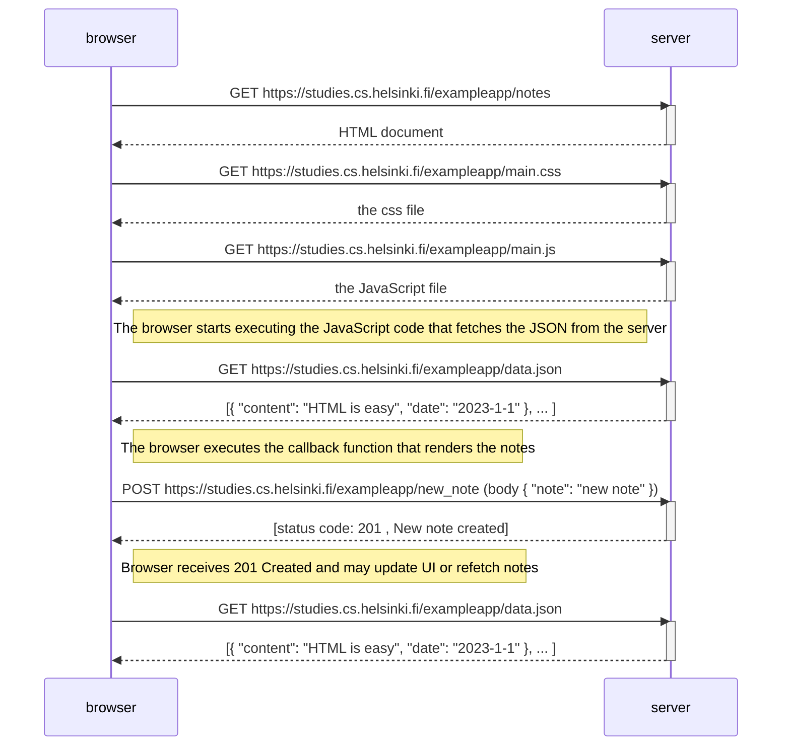

# 📌 Full Stack Open Projects

This repository contains my work and exercises from the [Full Stack Open](https://fullstackopen.com/) course offered by the University of Helsinki. The focus of this course is building modern web applications using JavaScript across the full stack.

---

## 🚀 What I'm Learning

- Building REST APIs and understanding how systems communicate over HTTP
- Frontend development with React
- Backend development with Node.js and Express
- Database integration (MongoDB)
- State management and component architecture
- Debugging, testing, and performance basics

---

## 🛠 Tech Stack

| Layer     | Technology              |
|-----------|-------------------------|
| Frontend  | React                   |
| Backend   | Node.js, Express        |
| Database  | MongoDB                 |
| Tools     | Git, VS Code, Postman   |

---


## 📂 Project Structure

Each folder corresponds to a part of the course:

```
FullStackOpen-certification/
├── 0/                  # Web Fundamentals (HTML, CSS, HTTP basics)
│   └── first-website/  # First static website exercise
├── part1/              # React basics (coming soon)
├── part2/              # Data fetching and forms (coming soon)
├── part3/              # Backend with Express (coming soon)
├── part4/              # Testing and API improvements (coming soon)
└── part5+/             # Advanced topics – auth, etc. (coming soon)
```

---

## ⚙️ How to Run

**Clone the repo:**

```bash
git clone https://github.com/Arshpreet62/FullStackOpen-certification.git
cd FullStackOpen-certification
```

**Install dependencies** (inside a specific part's folder):

```bash
npm install
```

**Run the app:**

```bash
npm start
```

---

## 🎯 Goals

- Build production-level full stack applications
- Understand how frontend and backend interact
- Write clean, maintainable code
- Prepare for real-world developer roles

---

## 📈 Progress

- [x] Part 0 – Web Fundamentals *(in progress)*
- [ ] Part 1 – React Basics
- [ ] Part 2 – Data Fetching & Forms
- [ ] Part 3 – Backend with Express
- [ ] Part 4 – Testing & API Improvements
- [ ] Part 5 – Advanced Topics (Auth, etc.)

---

## 💡 Key Takeaways

- APIs are not just code — they include networking, middleware, and data flow, which all affect performance
- Backend performance issues often come from architecture and scaling, not just logic
- Real-world systems require testing under load, not just local success

---

## 📬 Contact

If you want to connect or collaborate, feel free to reach out via [GitHub](https://github.com/Arshpreet62).



